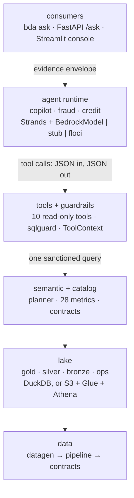

<div align="center">

# Banking Data Agents

**A governed, auditable multi-agent AI platform for banking data products.**

Versioned metrics · enforced SQL guardrails · evidence-carrying answers
· Amazon Bedrock + Strands Agents · CDK · testable offline

[](https://www.python.org/)
[](https://aws.amazon.com/bedrock/)
[](https://strandsagents.com/)
[](#verification)
[](#verification)
[](https://docs.astral.sh/ruff/)
[-brightgreen)](#verification)
[](#ci-cd)

[**Playbook**](docs/README.md) · [**Technologies**](docs/technologies/README.md) · [**Quickstart**](#quickstart) · [**Architecture**](#architecture)

</div>

---

> The point of this project is not that a language model can answer a question about
> customers. It is that the answer is **structurally trustworthy**: built from
> versioned metrics, permitted by an enforceable contract, and delivered with the
> evidence needed to defend it.

---

## Table of contents

- [The problem](#the-problem)
- [The four commitments](#the-four-commitments)
- [Architecture](#architecture)
- [Quickstart](#quickstart)
- [The CLI](#the-cli)
- [Data products](#data-products)
- [Technology stack](#technology-stack)
- [Verification](#verification)
- [CI/CD](#ci-cd)
- [Repository layout](#repository-layout)
- [Documentation](#documentation)

---

## The problem

An analyst asks a question the warehouse cannot answer directly:

> *"How many customers do we have by region?"*
> *"Which customers hold the most accounts?"*
> *"What is our exposure?"*

Today each one becomes a ticket, a data engineer, ad-hoc SQL, a spreadsheet three days
later, and a meeting about which of the two dashboards is right. The causes are
consistent:

| Cause | Consequence |
|-------|-------------|
| **Missing semantics** — "exposure" means several things | Two numbers, no way to arbitrate |
| **Missing trust signals** — nobody sees the quality state behind a figure | Decisions on silently stale data |
| **Missing self-service reasoning** — every question needs a translator | Days of latency |
| **Missing auditability** — no record of how a figure was produced | An unexplainable number under scrutiny |

This repository is a working answer to all four, and the answer is mostly **not** the
model. It is the governance around it.

---

## The four commitments

### 1 · The agent never writes free-form SQL

It selects **versioned metrics** from a governed semantic layer. The metric set lives
in `semantic/metrics/*.yaml` — **28 metrics** across three products, each with an
owner, a definition, a unit and a `sql_fragment`. A figure is traceable to
`metric.customer_count@1.0.0`. Numerical invention is **structurally difficult**
rather than merely discouraged.

### 2 · Every answer carries an evidence envelope

`agents/evidence.py` assembles, for every answer: the outcome, the SQL, the product
**and contract versions**, the metrics used, the row count and preview, the quality
state of the tables touched, the lineage, the governance decision, the cost, and a
trace of every tool call. One of six outcomes is always set —
`ANSWERED_FROM_DATA`, `ANSWERED_FROM_METADATA`, `NEEDS_CLARIFICATION`,
`NO_GOVERNED_METRIC`, `REFUSED`, `INCOMPLETE` — and the envelope survives the request
in DynamoDB, so `GET /answers/{trace_id}` reproduces months later exactly what a
caller was told.

### 3 · Enforcement over instruction

Anything that must not happen is blocked **below the model**, never by asking nicely
in a prompt. `tools/sqlguard.py::validate_sql` runs inside `execute_sql` and refuses
anything that is not a single `SELECT`, that leaves `gold`/`ops`, that reads the
fraud holdout `ops.fraud_ground_truth`, that uses `SELECT *`, or that has no `LIMIT`
under a 1000-row ceiling.

Prompts still say it — **defence in depth is free** — but the tests assert on the
guard.

### 4 · Nothing ships unmeasured

An evaluation gate with expected outcomes must pass before a deploy, followed by a
canary. Promotion pins the `live` endpoint to the version the canary served;
**rollback is a re-pin**, not a rebuild.

---

## Architecture



### Runs offline, deploys to AWS

| Concern | Local / CI | Floci or AWS |
|---------|-----------|--------------|
| Object storage | `LocalLake` (Parquet) | `S3Lake` — `bda-<env>-{bronze,silver,gold,ops,artifacts}` |
| Query engine | `DuckDBEngine` | `AthenaEngine` (Glue catalog, workgroup `bda-agents`) |
| Model | `StubModel` (deterministic) | `BedrockModel` |
| Answer retention | in-process store | DynamoDB `bda-<env>-answers` |

`config.py`, `pipeline/lake.py::get_lake` and `pipeline/engine.py::get_engine` are the
**only** places that choose. Nothing above them branches on the backend — which is why
the same tests run in both worlds, and why "tested locally, runs in production" is an
honest claim rather than a slogan.

---

## Quickstart

Requires [`uv`](https://docs.astral.sh/uv/) (it provisions CPython 3.12) and,
optionally, Docker for the Floci emulator.

```bash
cd banking-data-agents

make bootstrap                        # .env, dependencies, toolchain check
uv run bda data generate              # 1,220,122 rows across 108 datasets, ~2.9 s
uv run bda pipeline run               # bronze → silver → gold → publish, ~9.5 s
uv run bda catalog list               # 3 products, 28 metrics
uv run bda ask "How many customers do we have by region?"
uv run bda eval                       # the release gate — passes 100%
```

Everything at once, narrated:

```bash
uv run bda demo                       # 7 steps, all green, ~14 s
```

`make` targets are convenience wrappers; every one is also `uv run bda <command>`,
which is what CI calls.

---

## The CLI

```text
bda bootstrap [--check-only]          prepare and verify a working environment
bda floci {up|down|status}            control the local AWS emulator
bda data generate [--seed N]          synthetic source data
bda pipeline {run|dq} [--stages …]    bronze → silver → gold → publish (+ dq)
bda catalog [list|PRODUCT]            inspect published data products
bda ask "…" [--no-sql] [--json]       ask the Copilot
bda answers {get TRACE|list} [--json] read back a retained answer
bda eval [--suite …] [--fail-under F] the evaluation gate
bda serve [--host] [--port]           the FastAPI service
bda ui [--port]                       the Streamlit analyst console
bda infra {synth|deploy|destroy}      CDK, per environment
bda demo [--skip-data]                end-to-end demonstration
bda clean                             remove caches and generated artefacts
```

> **`bda ask` exits non-zero on an incomplete answer**, so CI treats "the agent
> shrugged" as a failure rather than a log line.

---

## Data products

Three products, each described by a **machine-readable contract** in `contracts/` that
is both documentation and runtime input: schema, semantics, owner, freshness SLA,
quality rules and — critically — `not_allowed_use`.

| Product | Version | Grain | Rows | Metrics | Example |
|---------|---------|-------|------|---------|---------|
| `customer_360` | `2.3.0` | one row per customer | 2,000 | 13 | `customer_count`, `total_balance` |
| `transaction` | `1.6.0` | one row per transaction | 1,083,322 | 7 | volume, average value |
| `credit_risk` | `2.1.0` | one row per customer | 2,000 | 8 | `dti`, `total_outstanding` |

`customer_360` declares that it may **not** be used for
`marketing_targeting_on_credit_score` or
`individual_credit_decisions_without_human_review`. An agent asked to do so returns
`REFUSED` with `sql: null` and the clause named.

**That is a test case, not a paragraph.**

---

## Technology stack

| Layer | Technology |
|-------|-----------|
| Runtime & packaging | CPython 3.12, `uv`, Hatchling |
| Dataframes & formats | Polars, Apache Arrow, Parquet |
| Query engine | DuckDB (local) · Amazon Athena (cloud) |
| SQL analysis | SQLGlot (AST-based guardrail) |
| Agents | Strands Agents SDK |
| Models | Amazon Bedrock · Bedrock AgentCore · Bedrock Guardrails |
| Cloud | S3, Glue, Lake Formation, DynamoDB, KMS, Secrets Manager, Step Functions, ECS, ECR, Cognito, CloudWatch |
| Validation | Pydantic 2, `pydantic-settings` |
| Serving | FastAPI + Uvicorn · Streamlit |
| Ops | structlog · Rich · Tenacity · HTTPX |
| Infrastructure | AWS CDK (Python) — 11 stacks |
| CI/CD | GitHub Actions · OIDC (no stored AWS keys) |
| Testing | pytest · `moto` · Floci (local AWS emulator) |
| Quality | Ruff · mypy |

Every one of these is taught from first principles in the
[**technologies track**](docs/technologies/README.md) — 19 chapters, each with a
mental model, a runnable exercise, and a note on what bites in production.

---

## Verification

These are **measured**, not estimated. Reproduce them with the commands shown.

| Gate | Command | Result |
|------|---------|--------|
| Tests | `uv run pytest -q` | **372 passed**, 2 skipped |
| Lint | `uv run ruff check .` | **All checks passed** |
| Types | `uv run mypy src` | **no issues in 54 source files** |
| Eval gate | `uv run bda eval` | **31/31 · 100.0% · 0 critical failures** |
| End to end | `uv run bda demo` | **7/7 steps**, ~14 s |
| Infra | `uv run bda infra synth --env dev` | **11 stacks**, clean |

### Honest limits

A green suite should not be read as "everything is proven". What is *not* verified
here, stated plainly:

- **The Docker-dependent paths are unexecuted.** The Docker daemon was not running, so
  Floci could not start, so the S3/Glue/Athena end-to-end path and **2 integration
  tests** were skipped rather than passed. The code is written and synth-verified, and
  covered offline by `moto` — it is *unexecuted*, not *unwritten*. Start Docker Desktop
  and run `make floci-up && uv run pytest -m integration -v` to close it.
- **The agents ran on the deterministic stub provider.** Real Bedrock calls are wired
  and configured, but no tokens were spent, so real-model behaviour is untested here.
- **All data is synthetic.** No real customer record exists in this repository, in any
  commit.

---

## CI/CD

Eleven workflows in `.github/workflows/`, each with a narrow job.

| Workflow | Trigger | Gate |
|----------|---------|------|
| `ci.yml` | push, PR | lint · types · tests |
| `eval-pr.yml` | PR | evaluation suite — fails on regression |
| `eval-nightly.yml` | schedule | eval vs baseline (model/data drift) |
| `data-pipeline.yml` | merge, schedule | the medallion run |
| `security.yml` | PR | dependency & secret scanning |
| `drift.yml` | schedule | infrastructure drift |
| `deploy.yml` | reusable | called by the three below |
| `deploy-dev.yml` | merge | auto-deploy |
| `deploy-staging.yml` | manual | with approval |
| `deploy-prod.yml` | manual | **environment-protected** |
| `rollback.yml` | manual | re-pin to a previous agent version |

Deploys use **OIDC federation** — GitHub mints a short-lived token per job and AWS
exchanges it for temporary credentials scoped by claims. **No long-lived AWS key is
stored anywhere.** `infra/bootstrap/` provisions the deploy roles, the state bucket
and a permissions boundary, once per account.

Environments: **`dev`** (auto) → **`staging`** (approval) → **`prod`** (protected).
Every physical resource is named `bda-<env>-<name>` by one function,
`infra/config.py::qualify`.

---

## Repository layout

```text
banking-data-agents/
├── contracts/                 data product contracts — the promise
├── semantic/
│   ├── metrics/*.yaml         28 versioned metric fragments — the vocabulary
│   └── planner.py             deterministic language → query
├── src/banking_data_agents/
│   ├── config.py              settings; the one place that knows the environment
│   ├── aws.py                 boto3 factory (Floci-aware)
│   ├── logging_setup.py       structlog; diagnostics never touch stdout
│   ├── telemetry.py           CloudWatch EMF metrics — nothing fictional
│   ├── audit.py               answer retention (DynamoDB) + its local twin
│   ├── cli*.py                the command line
│   ├── datagen/               deterministic synthetic source systems
│   ├── pipeline/              lake · engine · runner · dq · publish · sql/
│   ├── catalog/               catalog + contract loading
│   ├── tools/                 the 10 tools · the SQL guard · ToolContext
│   ├── agents/                base · copilot · fraud · credit · evidence
│   ├── llm/                   stub | floci | bedrock, behind one factory
│   ├── evals/                 cases and the runner
│   ├── api/                   FastAPI service
│   └── ui/                    Streamlit analyst console
├── infra/                     CDK — 11 stacks + a one-time bootstrap
├── docs/                      the playbook + the technologies track
├── tests/                     unit · integration · smoke
└── .github/workflows/         11 workflows, OIDC, no stored keys
```

---

## Documentation

Two complementary tracks, both production-grade.

### [The playbook →](docs/README.md)

**How the system works and why it is shaped this way.** One chapter per service or
step, each ending with *where this lands in production* and the invariants a change
must not break.

| Start here | For a specific job |
|-----------|-------------------|
| [01 Architecture](docs/01-architecture.md) | [18 Operations runbook](docs/18-operations-runbook.md) |
| [05 Data contracts](docs/05-data-contracts.md) | [19 Troubleshooting](docs/19-troubleshooting.md) |
| [08 SQL guardrails](docs/08-sql-guardrails.md) | [16 CI/CD and environments](docs/16-cicd-and-environments.md) |
| [09 Agents and Bedrock](docs/09-agents-and-bedrock.md) | [17 Security and compliance](docs/17-security-and-compliance.md) |
| [10 The evidence envelope](docs/10-the-evidence-envelope.md) | [15 Infrastructure](docs/15-infrastructure.md) |

### [The technologies track →](docs/technologies/README.md)

**Every tool in the stack, from zero to hero.** One chapter per technology, each with
*The idea · The mental model · The minimum you need · In this project · Level up*,
plus a runnable exercise.

`uv` · Polars & Parquet · DuckDB · SQLGlot · boto3 · the AWS analytics stack · Strands
· Bedrock & AgentCore · Pydantic · FastAPI & ASGI · Streamlit · Rich/structlog/tenacity
· CDK · GitHub Actions & OIDC · pytest & moto · Ruff & mypy · CloudWatch EMF · and a
[capstone](docs/technologies/18-from-zero-to-hero.md) that ties it together.

---

<div align="center">

### Notes

All data is **synthetic** — there are no real customer records anywhere in this
repository, in any commit.

The dataset deliberately contains **incidents** — impossible negative balances,
duplicated customers, schema drift — because a data platform that has never met bad
data is a demo, not a platform.

Sample project. See the [playbook](docs/README.md) for the design rationale.

</div>
